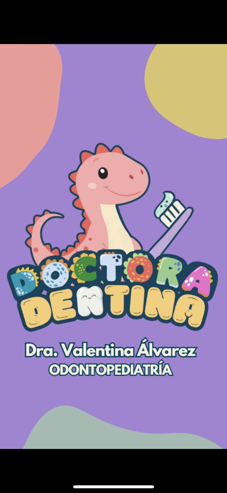

<p align="center">
  
</p>

<h1 align="center">TinAR - WebAR Educativo Dental</h1>

<p align="center">
  <strong>Experiencia de realidad aumentada educativa para enseñar técnica de cepillado dental a niños de 3-8 años</strong>
</p>

<p align="center">
  <a href="#características">Características</a> •
  <a href="#cómo-usar">Cómo Usar</a> •
  <a href="#tecnologías">Tecnologías</a> •
  <a href="#compatibilidad">Compatibilidad</a> •
  <a href="#estructura-del-proyecto">Estructura</a>
</p>

---

## 🦕 Sobre el Proyecto

**TinAR** es una aplicación WebAR educativa diseñada para ayudar a los niños de 3-8 años a aprender la técnica correcta de cepillado dental de manera divertida e interactiva.

### El Problema
Los niños de 3-8 años frecuentemente no cepillan correctamente sus dientes, lo que lleva a problemas dentales como caries y enfermedad gingival. Además, la ansiedad dental es común en esta edad.

### La Solución
Una experiencia WebAR donde **Tina**, una amigable dinosauria, guía al niño a través de una sesión de cepillado completa (2 minutos) con:
- ✅ Técnica correcta según guías ADA (45°, movimientos circulares)
- ✅ Feedback positivo constante
- ✅ Sin necesidad de instalación
- ✅ Accesible desde cualquier smartphone

---

## ✨ Características

| Característica | Descripción |
|---------------|-------------|
| 🦷 **Guía de 4 Zonas** | Cepillado completo dividido en 4 zonas (30s cada una) |
| 🗣️ **Audio Multilingüe** | Español, Inglés y Portugués con Web Speech API |
| 🎨 **Overlays Educativos** | Flechas de 45° y círculos animados para guiar el movimiento |
| ⏱️ **Timer Circular** | Temporizador visual con progreso animado |
| 🎉 **Celebración** | Confetti y estrellas al completar el cepillado |
| 🦕 **Tina Animada** | Modelo 3D optimizado con animaciones (wave, breathing, celebration) |
| 📱 **Mobile-First** | Diseñado para smartphones, sin necesidad de instalación |

---

## 🚀 Cómo Usar

### Paso 1: Preparación
1. **Imprime el marcador AR** disponible en `assets/images/card_marker.png` ⚠️ **IMPORTANTE: Usar esta imagen específica**
2. Asegúrate de tener buena iluminación en el área donde usarás la app

### Paso 2: Acceso
1. Abre la aplicación desde tu dispositivo móvil: **[TinAR en GitHub Pages](https://talivanferrada.github.io/TinAR/)**
2. Permite el acceso a la cámara cuando el navegador lo solicite

### Paso 3: Experiencia AR
1. Apunta la cámara hacia el marcador impreso
2. ¡Tina aparecerá y te saludará! 🦕
3. Sigue las instrucciones de Tina para cepillar cada zona:
   - **Zona 1:** Dientes superiores derechos (30s)
   - **Zona 2:** Dientes superiores izquierdos (30s)
   - **Zona 3:** Dientes inferiores derechos (30s)
   - **Zona 4:** Dientes inferiores izquierdos (30s)
4. ¡Celebra con Tina al completar todas las zonas! 🎉

### Paso 4: Configuración
- Usa los botones **ES / EN / PT** para cambiar el idioma
- El audio se reproduce automáticamente con instrucciones verbales

---

## 🛠️ Tecnologías

| Tecnología | Uso |
|-----------|-----|
| [MindAR](https://hiukim.github.io/mind-ar-js-doc/) | Framework de realidad aumentada (Image Tracking) |
| [A-Frame](https://aframe.io/) | Framework 3D/WebXR |
| [Web Speech API](https://developer.mozilla.org/en-US/docs/Web/API/Web_Speech_API) | Síntesis de voz multilingüe |
| HTML5, CSS3, JavaScript ES6 | Frontend nativo |
| glTF/GLB | Formato de modelo 3D optimizado |

### Optimizaciones
- Modelo 3D optimizado de 87MB a 2.1MB usando Draco compression
- Assets preloaded para carga rápida
- Total bundle: ~3.4MB (bien bajo el objetivo de 10MB)

---

## 📱 Compatibilidad

| Plataforma | Navegador | Estado |
|-----------|-----------|--------|
| **Android** | Chrome 90+ | ✅ Completamente soportado |
| **iOS** | Safari 15+ | ✅ Completamente soportado |
| **Android** | Firefox | ⚠️ Funcional, puede variar |
| **Desktop** | Chrome/Safari | ⚠️ Requiere cámara web |

> **Nota:** La experiencia está optimizada para dispositivos móviles. Se requiere acceso a cámara y conexión HTTPS.

---

## 📁 Estructura del Proyecto

```
TinAR/
├── index.html              # Página principal (AR Scene)
├── .nojekyll              # Configuración GitHub Pages
├── css/
│   └── styles.css         # Estilos del UI
├── src/
│   ├── app.js             # Aplicación principal
│   ├── state-manager.js   # Máquina de estados (INTRO→ZONES→CELEBRATION)
│   ├── audio-manager.js   # Gestión de audio multilingüe
│   ├── animation-manager.js # Animaciones de Tina
│   └── ui-manager.js      # UI overlays, timer, partículas
├── assets/
│   ├── models/
│   │   └── Tina_optimized.glb  # Modelo 3D de Tina (2.1MB)
│   ├── images/
│   │   ├── marker.png      # Marcador AR imprimible
│   │   └── qr-code.png    # QR para acceso rápido
│   └── targets/
│       └── marker.mind    # Target compilado para MindAR
├── Logo/
│   └── logo-dentina.jpeg  # Logo de Doctora Dentina
└── README.md              # Este archivo
```

---

## 📷 QR Code

Escanea el código QR para acceder directamente desde tu móvil:

<p align="center">
  
</p>

> **URL de acceso:** `https://talivanferrada.github.io/TinAR/`

---

## 🎮 Demo

1. Imprime el marcador desde `assets/images/marker.png`
2. Escanea el QR o accede a la URL
3. Apunta la cámara al marcador

---

## 👥 Créditos

### Marca Doctora Dentina
Proyecto desarrollado como parte de la iniciativa educativa **Doctora Dentina**, enfocada en la salud dental infantil.

### Desarrollo
- Diseño y desarrollo de experiencia WebAR
- Optimización de modelos 3D
- Sistema de estados y audio multilingüe
- UI/UX mobile-first

### Agradecimientos
- [MindAR](https://hiukim.github.io/mind-ar-js-doc/) por el excelente framework AR
- [A-Frame](https://aframe.io/) por la plataforma 3D
- Comunidad de WebXR

---

## 📄 Licencia

Este proyecto es parte del material educativo de Doctora Dentina.

---

<p align="center">
  <strong>🦕 Tina te espera para cepillar juntos! 🦷</strong>
</p>
